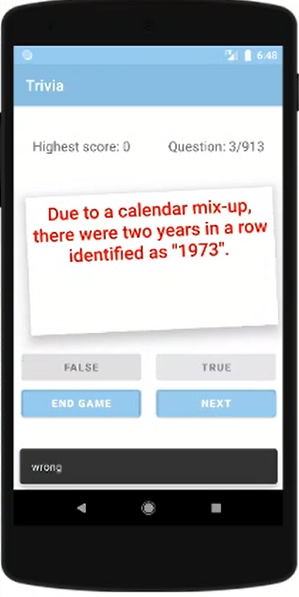
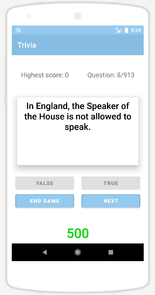
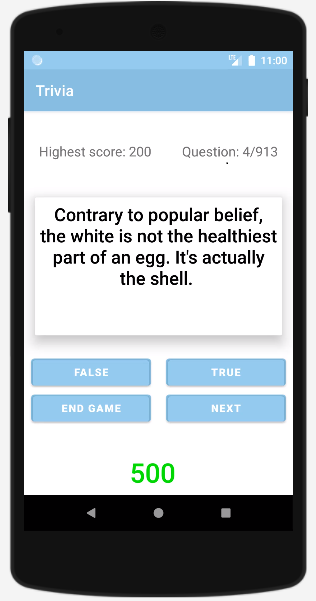

### ANDROID APP - Trivia-Game
This is my third Android app.  

It's a trivia game developed using Java, XML and Android Studio and uses animations, saves score data using SharedPreferences and extracts questions by parsing in JSON.  
I build it to put together the knowledge gained from developing my previous apps and to create something a bit more complex.  

The question box rotates when the answer is incorrect and the text colour changes to red.
When the answer is right, the box size widens and the text colour changes to green

 
 
 

