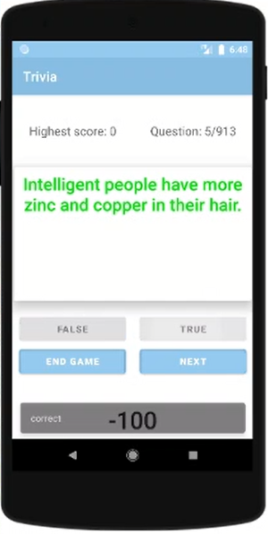

### ANDROID APP - Trivia-Game
This is my third Android app.  

It's a trivia game developed using Java, XML and Android Studio and it uses animations, saves score data using SharedPreferences and extracts questions by parsing in JSON.  
I built it to combine the knowledge gained from developing my previous apps to create something a bit more complex.  

When the answer is incorrect the question box rotates and the text colour changes to red.
When the answer is correct, the box size widens and the text colour changes to green

 
 
 

